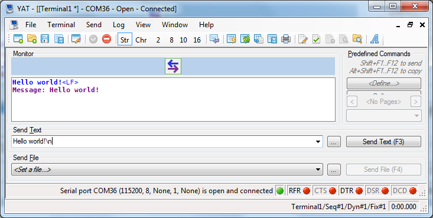
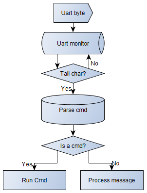

# uart-command-parser
Concerning debugging in the embedded application, a common method is to change the input value by pressing the button. 

Generally, a button has two available states: pressed and unpressed, which means we can provide only two different input for testing. But in many cases, I would like to input as many values as I want in the testing. That's why I make this project.

With this project, actually it's a pair of .c and .h files, user types the command in UART terminal and firmware executes the corresponding handler.

## Usage

The basic usage is:

`@` `command_string` `=` `command_parameter` `\n`

'@' is the prefix of a command. 

command_string is user defined and its length should be less than 5 bytes.

command_parameter will be passed to user defined handler. And the total length of input string should be less than 64 bytes.

The total string ends with a new line sign '\n'(0x0A).

A string without @ prefix will be parsed as a **Message**. Message will be printed out immediately in current project. (If we route the message to BLE notification interface, it is BLE-UART passthrough.)

## Example

I prepare three sets of command in the applicaiton code:

- {"APP1", appHandler1}
- {"APP2", appHandler2}
- {"APP3", appHandler3} 

And register these handlers to the handler table:

```C
#include "ucmd.h"

void app_handler1(uint8* data, uint8 len)
{
    ucmd_print("Command: name=%s, param=", "APP1");
    if (len == 0) {
        ucmd_print("NULL");   
    }
    else {
        uint8 i;
        for (i = 0; i < len; i++) {
            ucmd_print("%c", data[i]);   
        }
    }
    ucmd_print("\r\n");
}

void app_handler2(uint8* data, uint8 len){;}
void app_handler3(uint8* data, uint8 len){;}

ucmd_registerHandler("APP1", app_handler1);
ucmd_registerHandler("APP2", app_handler2);
ucmd_registerHandler("APP3", app_handler3);
```

In the UART terminal, type `@APP1=123456\n`, then appHandler1 will be invoked with parameter "123456", as shown in the following figure:


If typing a stirng without `@` prefix, the terminal will print the echo string:



## Work Flow

UART is the core of this system. It monitors the input byte stream continousely and save bytes in a buffer. Once finding a tail tag('\n'), parse and process it.



- Uart Monitor: It's the UART RX interrupt.
- Parser cmd: Once it find a command, push it to a task queue. So it has potential to process multiple tasks.
- Run cmd: user can register arbitrary quantity of command by hand.

## Note

This project is **half-complete.** It should work basically, however, I don't do many tests on it.

Unfortunately, I don't have time(or chance) to improve it anymore. :-(

I think it's still helpful if someone has a heavy debugging task or wants to implement a BLE-UART passthrough project.

(End)